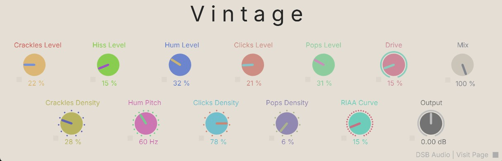

# Vintage
Vinyl textures plugin for plugdata VST

# 📼 Vintage – Vinyl Texture Simulator for PlugData

**Vintage** is a *vinyl-style audio coloration patch* built in **PlugData**, designed to be used as a VST/AU plugin inside your DAW. Inspired by the sonic character of analog record playback, it emulates texture, coloration, and nonlinear artifacts to give your tracks a nostalgic edge.

---

---

## 🎛️ Features

- 📼 Crackle, Hiss, Hum, Clicks & Pops controls for layered vinyl noise
- 🌀 Hum pitch modulation to simulate wow & flutter
- 🎚️ Drive knob for subtle analog-style saturation
- 📏 RIAA Curve control to gradually apply vintage spectral coloration
- 🔁 Density controls for dynamic noise behavior
- 🔊 Mix knob and Output gain for proper balance and integration
- 🧩 Clean GUI for intuitive parameter access
- 💾 Works seamlessly in PlugData’s plugin architecture

---

## 🧰 Usage

Drop **Vintage** into PlugData and use it as a texture plugin within your DAW.  
Each parameter simulates a unique artifact from vinyl playback: Crackles and Pops create transient accents, Hiss and Hum add a noise floor, and the Drive knob introduces mild harmonic saturation.

The **RIAA Curve** gradually shapes the EQ response to replicate vinyl coloration — from subtle rounding to full analog tilt.

Ideal for lo-fi beats, ambient layers, retro synths, or warming up sterile mixes.

---

## 📁 Included Files

- `vintage~.pd` → main patch  
- `gui.jpg` → GUI image preview  
- `logo.jpg` → logo for presentation  
- `README.md` → documentation  

---

## ✅ Requirements

- [PlugData](https://plugdata.org/) installed  
- Compatible DAW for VST/AU hosting  
- No external libraries required

---

## 👤 Credits

Developed by Diego @ DSB AUDIO based and inspired for some examples of the Andy Farnell's book "Designing Sounds". 
Crafted to bring warmth, wear, and wobble into your digital mix ❤️
